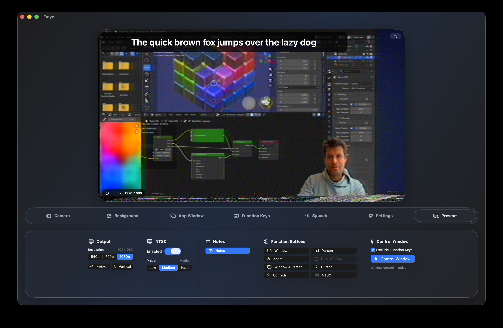

<p align="center">
  
</p>

<p align="center">
  <a href="assets/screenshot.jpg">
    
  </a>
</p>

# Emyn

Emyn is a macOS virtual camera app for presenting yourself, app windows, media, and live captions as a single configurable camera feed. It captures a physical camera, removes or replaces the background, composites window captures or media into the output, and publishes the rendered frames through a Core Media IO camera extension.

## Features

- Physical camera capture with selectable input quality.
- Virtual camera output through `EmynVirtualCameraExtension`.
- Person segmentation with configurable quality, analysis resolution, mask blur, smoothing, and mask reuse.
- Background replacement with solid colors, blur, image/video media, or captured app windows.
- Multi-window selection, ordering, fitting, alignment, cycling, and direct window-control forwarding.
- Presentation controls for output resolution, horizontal/vertical flip, NTSC effect presets, zoom, cursor emphasis, image overlays, and confetti.
- Function-key shortcuts for live presentation actions.
- Presentation notes sidebar.
- Local speech-to-text configuration for caption styling, microphone selection, and downloadable GGUF models.

## Requirements

- macOS 13 or newer.
- Xcode with macOS development tools.
- Rust toolchain with `rustup` for rebuilding the macOS platform XCFramework.
- Apple developer signing setup for installing the virtual camera system extension outside local unsigned development.

The app uses camera, microphone, screen recording, accessibility, input monitoring, and system extension permissions depending on which features are enabled.

## Repository Layout

- `Emyn/` - SwiftUI app, camera pipeline, preview UI, presentation controls, and performance core sources.
- `EmynVirtualCameraExtension/` - Core Media IO system extension that exposes the generated frames as a virtual camera.
- `platform-macos/` - Rust macOS platform layer, UniFFI bindings, ScreenCaptureKit/window-control support, input forwarding, and NTSC processing.
- `platform-macos/swift/PlatformMacOSKit/` - Generated Swift package and XCFramework consumed by the app.
- `transcribe-cpp-swift/` - Local Swift package for speech-to-text integration.
- `EmynPerformanceTests/` - Swift package tests for performance-sensitive sizing and render gate logic.
- `tools/` - Development harnesses.

## Building

Open `Emyn.xcodeproj` in Xcode and build the `Emyn` scheme.

If you change the Rust platform layer, rebuild the Swift XCFramework first:

```sh
./platform-macos/scripts/build-xcframework.sh
```

Then build from the command line:

```sh
xcodebuild -project Emyn.xcodeproj -scheme Emyn -configuration Debug -destination 'platform=macOS' build
```

For release packaging, the repository includes:

```sh
./release.sh --build-only
```

Use `./release.sh --help` for signing, notarization, and XCFramework options.

## Tests

The performance core can be tested through Swift Package Manager:

```sh
swift test
```

## License

Emyn is available under the MIT License. See [LICENSE](LICENSE).
